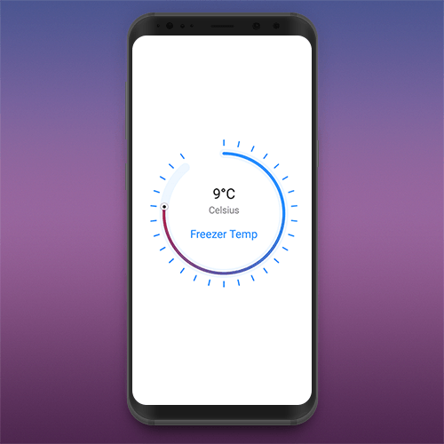

# TemperatureView   

## a view to choose tempereture in IoT(Intenet of things) applications

<br />

**Download sample app &nbsp;** [](https://github.com/ali-moghadam/TemperatureView/blob/master/files/temperatureView.apk?raw=true)



<br />

#### Step 1. Add the JitPack repository to your build file
```gradle	
allprojects {
		repositories {
			...
			maven { url 'https://jitpack.io' }
		}
	}
```

<br />

#### Step 2. Add the dependency
```gradle	
	dependencies {
	        implementation 'com.github.alipapital:TemperatureView:1.0'
	}
```

<br />

#### Step 3. Add TempretureView in your layout
```xml
   <com.alirnp.tempretureview.TemperatureView
            android:id="@+id/temperatureView"
            android:layout_width="match_parent"
            android:layout_height="0dp"
            app:layout_constraintHeight_default="percent"
            app:layout_constraintHeight_percent="0.5"

            app:tmv_color_primary="@color/tmv_default_color_primary"
            app:tmv_size_stroke_width="20dp"
            app:tmv_size_text_bottom="25sp"
            app:tmv_size_text_top="32sp"
            app:tmv_text_bottom="Freezer Temp"
            app:tmv_value="9"
            app:tmv_value_max="12"
            app:tmv_value_max_sweep_degree="320"
            app:tmv_value_min="-10" />
```
<br />

### Properties

|xml|kotlin|Type|Description|
|:---:|:---:|:---:|:---:|
|`tmv_value`|setValue()|Int|current temperature value|
|`tmv_value_min`|setMinValue()|Int|min temperature value|
|`tmv_value_max`|setMaxValue()|Int|max temperature value|
|`tmv_value_max_sweep_degree`|[NOT_YET]|Float|temperature degree range|
|`tmv_color_primary`|[NOT_YET]|color|view's color primary|
|`tmv_size_stroke_width`|[NOT_YET]|Float|view's stroke width|
|`tmv_size_text_top`|[NOT_YET]|String|show kind of temp (Ex:celsius)|
|`tmv_size_text_bottom`|[NOT_YET]|String|describe view|


<br/> 

### Change config values programmatically
```kotlin
val temperatureView = findViewById<TemperatureView>(R.id.temperatureView)

val minValue = -10
val value = 2
val maxValue = 12

val config = Config("random config!", value, minValue, maxValue)
temperatureView.config(config)
```    
<br/> 

#### OnSeekChangeListener
##### When temperature changed value

```kotlin
temperatureView.setOnSeekChangeListener { value ->
         // do stuff
        }
```

<br/>

#### OnSeekCompleteListener
##### When seek pointer's view finish
```kotlin
        temperatureView.setOnSeekCompleteListener {
         // do stuff
       
       }
```
<br/>

#### OnMoveListener
##### When pointer is seeking by user
> **_NOTE:_**  You can disable scrolling of ScrollView when isMoving = true

```kotlin
       temperatureView.setOnMoveListener { isMoving ->
         // do stuff
        }
   
